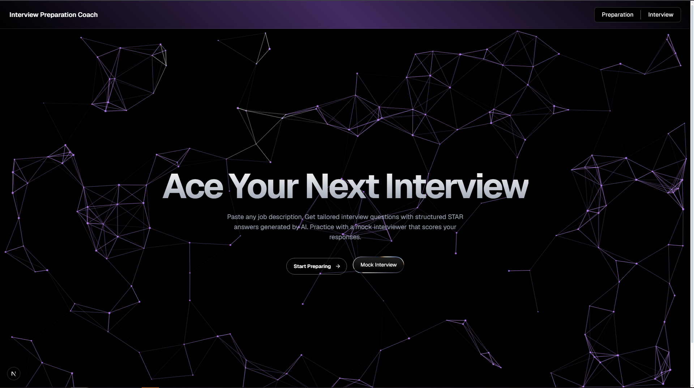

<h1 align="center">AI Interview Prep Coach</h1>

<p align="center">
  
  
  
  
  
  
</p>

<h3 align="center">About</h3>

<p align="center">
  An AI-powered web application that helps job candidates prepare for interviews by generating tailored questions and structured STAR answers from any job description. Features a mock interview mode with real-time AI scoring and feedback. Built with Next.js, TypeScript, Tailwind CSS, and Google Gemini API with streaming responses.
</p>

---

## Features

- **Tailored Questions** -- Paste any job description and receive 10 interview questions specific to that role, covering behavioral, technical, and culture fit categories.
- **STAR Format Answers** -- Each question comes with a structured answer (Situation, Task, Action, Result) so you know exactly how to respond.
- **Mock Interview Mode** -- Practice answering questions in a conversational format. The AI coach scores each answer out of 10 and provides actionable feedback.
- **Real-Time Streaming** -- Answers appear word by word as they are generated. No waiting for the full response.
- **One-Click Copy** -- Copy any answer to your clipboard for quick revision.
- **Dark Theme** -- Clean, modern dark UI built for extended study sessions.

---

## Screenshots

<p align="center">
  
  <br />
  <em>Landing page with animated particle canvas and quick access to both modes.</em>
</p>

<br />

<p align="center">
  
  <br />
  <em>Mock interview mode with real-time AI feedback and scoring.</em>
</p>

---

## Tech Stack

| Layer | Technology |
|-------|------------|
| Frontend | Next.js 16, React 19, TypeScript |
| Styling | Tailwind CSS 4 |
| AI Backend | Google Gemini 2.5 Flash (streaming via SSE) |
| Animations | Framer Motion, Custom WebGL Shaders |
| Deployment | Render |

---

## Getting Started

### Prerequisites

- Node.js 18 or later
- A Google Gemini API key (free at [aistudio.google.com](https://aistudio.google.com))

### Installation

```bash
git clone https://github.com/encode-abdullah/AI-Interview-Coach.git
cd ai-interview-coach
npm install
```

### Environment Variables

Create a `.env.local` file in the root directory:

```
GEMINI_API_KEY=your_api_key_here
```

### Run Development Server

```bash
npm run dev
```

Open [http://localhost:3000](http://localhost:3000) in your browser.

---

## How It Works

1. **Paste a Job Description** -- Copy any job listing from LinkedIn, Indeed, or a company careers page.
2. **Generate Questions** -- The AI analyzes the role and generates 10 tailored interview questions with STAR answers.
3. **Practice Mock Interviews** -- Switch to mock interview mode to practice answering questions out loud. The AI scores each response and tells you what to improve.

---

## Project Structure

```
ai-interview-coach/
  app/
    api/generate/route.ts    # Gemini API integration with SSE streaming
    prep/page.tsx            # Question generation page
    practice/page.tsx        # Mock interview page
  components/
    QuestionCard.tsx         # Expandable question card with STAR answer
    CopyButton.tsx           # Clipboard copy utility
    ui/
      hero-canvas.tsx        # Animated particle network canvas
      gradient-wave.tsx      # WebGL gradient wave background
      flow-button.tsx        # Arrow-slide animation button
      liquid-metal-button.tsx # Shader-based metallic button
  lib/
    prompts.ts               # AI prompt templates
```

---

## Future Improvements

- User accounts with saved prep history
- Voice-based mock interviews with speech-to-text
- Resume parsing to auto-fill job details
- Support for multiple AI models (GPT, Claude, Llama)

---

## License

This project is licensed under the MIT License.
